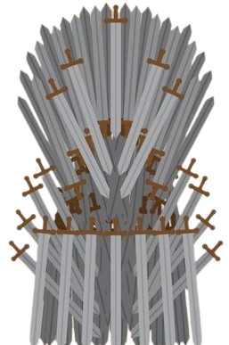
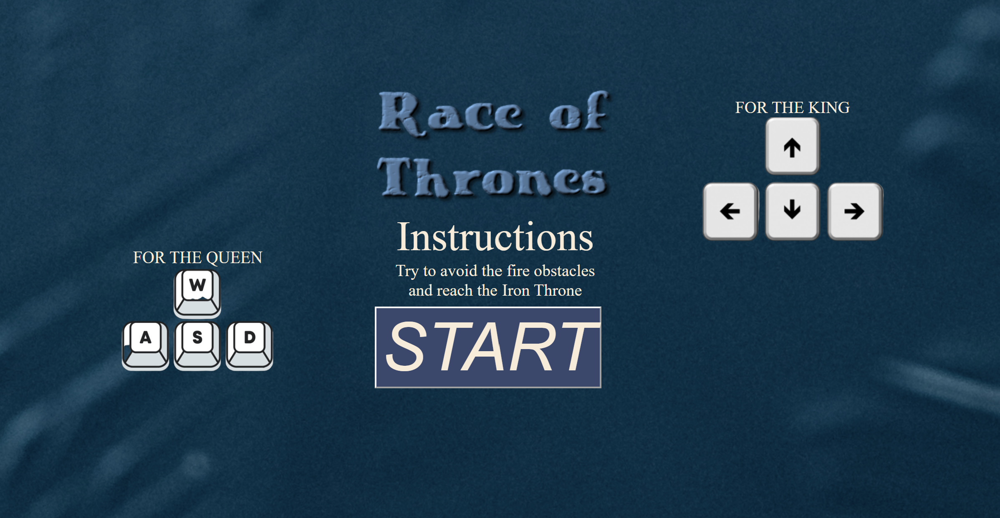

 

<h1 align="center" dir="auto"><strong>Race of Thrones Race!</strong></h1>
<h2 align="center" dir="auto">Two-Player platformer racing game created with JavaScript, HTML, CSS and Canvas</h2>

 
 
<h3><strong>Introduction:</strong></h3>
<ul>
<li>Race of Thrones it's a two-players game when Daenerys and Jon Snow are racing. The first that reach the Iron Throne, wins the race. Both of the characters have deadly obstacles on the way. In order to reach the Iron Throne, they need to avoid them.</li>
<li>In the Game of Thrones, you either win or you die. In the mythical continent of Westeros, nine families of higher nobility (Targaryen, Lannisters, Starks, Tyrell, Martell, Greyjoys, Baratheons and Boltons) scramble bitterly to gain power over the seven kingdoms and the Iron throne.</li></ul>
 
<h3><strong>About:</strong></h3>
<ul>
<li>This is the result of my first <strong>Ironhack</strong> Web Development course project. The gameplay design is so simple that the user won’t find it difficult to use and understand.</li></ul>
 
<h3><strong>Difficulties:</strong></h3>
<ul><li>The challenges were many, but after 3 intense weeks of studying and with the knowledge acquired in the bootcamp, I managed to develop a simple and objective game. I did had support from my teacher and from my TA's, but also from a lot of research as well.</li>
</li></ul>
 
 
 
<h1 align="center" dir="auto">
<a rel="noopener noreferrer" href="https://dianamariaa98.github.io/Project_1_Game/" target="_blank"><strong>PLAY NOW!</strong></a></h1>
 
 

 
<h3><strong>Controls:</strong></h3>
<table>
<thead>
<tr style="border: 2px solid grey;">
<th style="border: 2px solid grey;">Keys</th>
<th style="border: 2px solid grey;">Keys</th>
<th style="border: 2px solid grey;">Action</th>
</tr>
</thead>
<tbody style="border: 2px solid grey;">
<tr style="border: 2px solid grey;">
<td style="border: 2px solid grey;"><strong><code>A,S,D,W</code></strong></td>
<td style="border: 2px solid grey;"><strong><code>ArrowUp, ArrowDown, ArrowLeft, ArrowRight</code></strong></td>
<td style="border: 2px solid grey;"><strong><code>Jump, race and avoid the fire obstacles.</code></strong></td>
</tr>
</tbody>
</table>
 
 
<h3><strong>References:</strong></h3>
<ul><a rel="noopener noreferrer" href="https://www.hbo.com/game-of-thrones" target="_blank"><li>Game of Thrones</li></a></ul>
</a>
